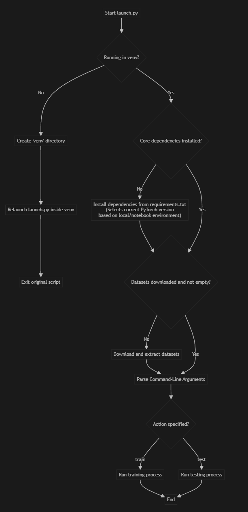

# Restormer

This repository provides the PyTorch implementation of the paper: [Restormer: Efficient Transformer for High-Resolution Image Restoration](https://arxiv.org/abs/2111.09881).

## Setup

For detailed setup instructions, please see [INSTALL.md](./INSTALL.md). The setup process has been automated into a single script.

## Training & Evaluation

The entire process of setting up the environment, downloading data, training, and evaluating the model is handled by a single script.

To run the full pipeline (setup, train, test):
```
python launch.py
```

### Customizing the Run

You can control which steps to run using flags:
- **Skip training and run only testing** (assuming a model is already trained):
  ```
  python launch.py --skip-train
  ```
- **Skip testing**:
  ```
  python launch.py --skip-test
  ```
- **Skip all setup steps** (dataset download and `setup.py`) if they've been done before:
  ```
  python launch.py --skip-install
  ```

For more options, see the help message:
```
python launch.py --help
```

### Pre-trained Models

Download the pre-trained models from the [official repository's link](https://drive.google.com/drive/folders/1ZEDDEVW0UgkpWi-N4Lj_JUoVChGXCu_u?usp=sharing) and place them in the `./pretrained_models/` directory. You can then use the `--skip-train` flag to run evaluation directly.

You can also test on a specific dataset:
```bash
python launch.py --test --dataset Rain100L
```

## Project Workflow

The following diagram illustrates the automated workflow managed by the `launch.py` script, from environment setup to execution:



## Contributing

Pull requests are welcome. For major changes, please open an issue first to discuss what you would like to change.
